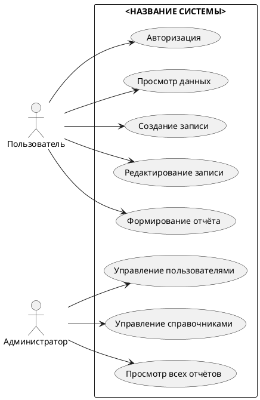
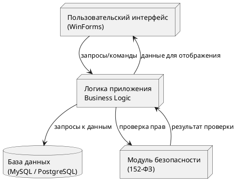

# Универсальные диаграммы для модульного экзамена

В этом файле расположены все диаграммы PlantUML:

1. Диаграмма прецедентов (Use Case)  
2. Пользовательский сценарий (Sequence)  
3. Архитектурная диаграмма  
4. Блок-схема алгоритма основной операции  

---

## 1. Диаграмма прецедентов (Use Case)



## 2. Пользовательский сценарий (Sequence Diagram)

```plamtuml
@startuml
actor User as U
participant "Интерфейс" as UI
participant "Логика приложения" as APP
database "База данных" as DB

U -> UI : Открыть форму\nвыполнения операции
UI -> APP : Передать введённые данные
APP -> DB : Проверка/запись данных
DB --> APP : Результат операции
APP --> UI : Сообщение об успехе/ошибке
UI --> U : Отображение результата
@enduml
```

## 3. Архитектурная диаграмма (уровневая)



