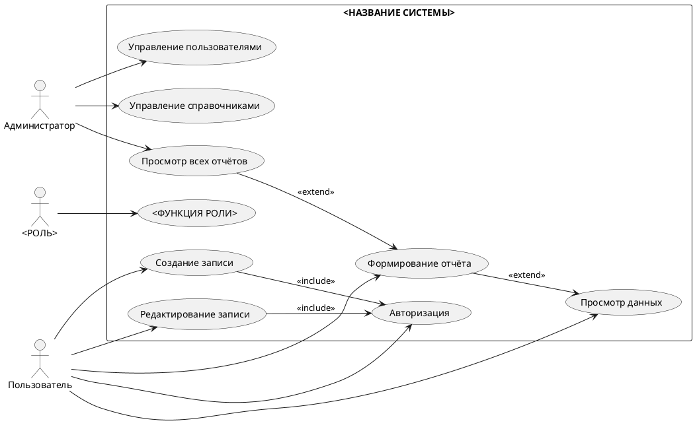
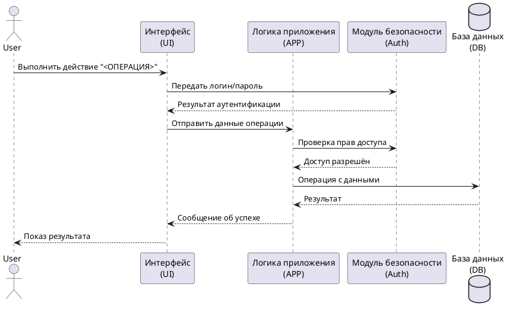
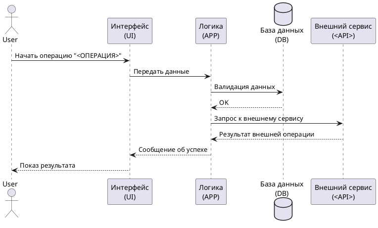
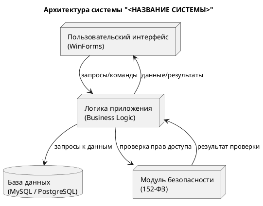
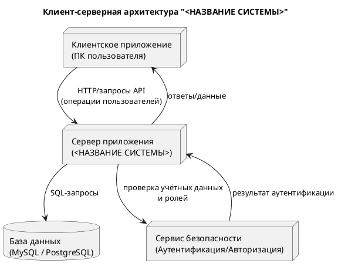
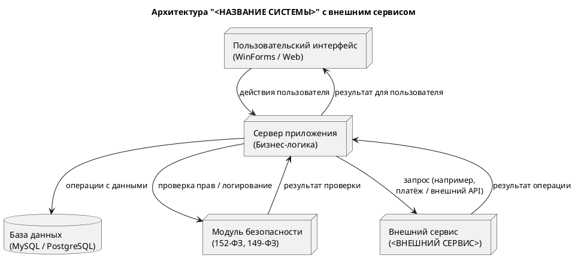

# Универсальные диаграммы для модульного экзамена

В этом файле расположены все диаграммы PlantUML:

1. Диаграмма прецедентов (Use Case)  
2. Пользовательский сценарий (Sequence)  
3. Архитектурная диаграмма  
4. Блок-схема алгоритма основной операции  

---

## 1. Диаграмма прецедентов (Use Case)



## 2. Пользовательский сценарий (Sequence Diagram)

### Вариант 1 — Базовый 

```plamtuml
@startuml
actor User as U
participant "Интерфейс\n(UI)" as UI
participant "Логика приложения\n(APP)" as APP
database "База данных\n(DB)" as DB

U -> UI : Открыть форму операции
UI -> APP : Передать введённые данные
APP -> DB : Проверка / запись данных
DB --> APP : Результат выполнения
APP --> UI : Сообщение об успехе / ошибке
UI --> U : Показ результата

@enduml
```

### Вариант 2 - С авторизацией



### Вариант 3 — Со внешним сервисом



## 3. Архитектурная диаграмма (уровневая)

### Вариант 1 — Трёхслойная архитектура



### Вариант 2 — Клиент–серверная архитектура



### Вариант 3 — Архитектура с внешним сервисом


